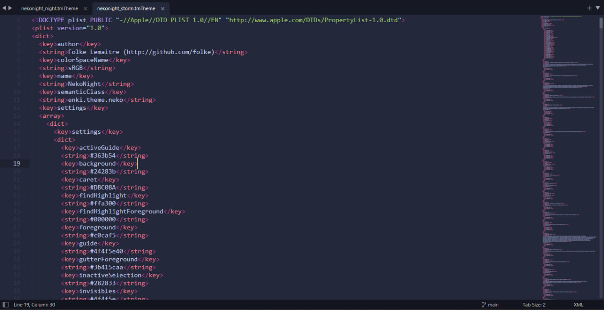
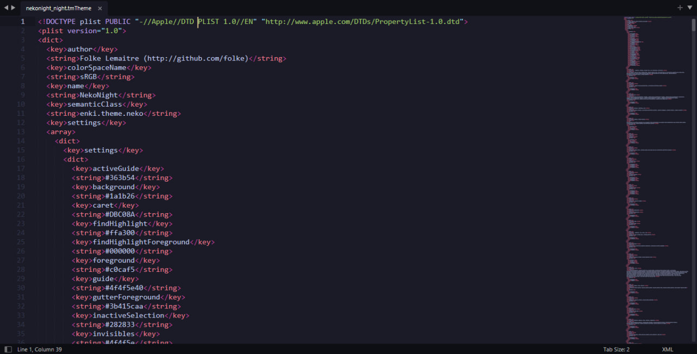
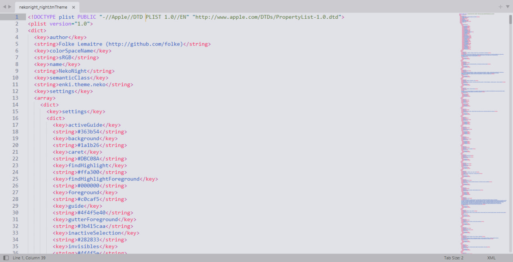
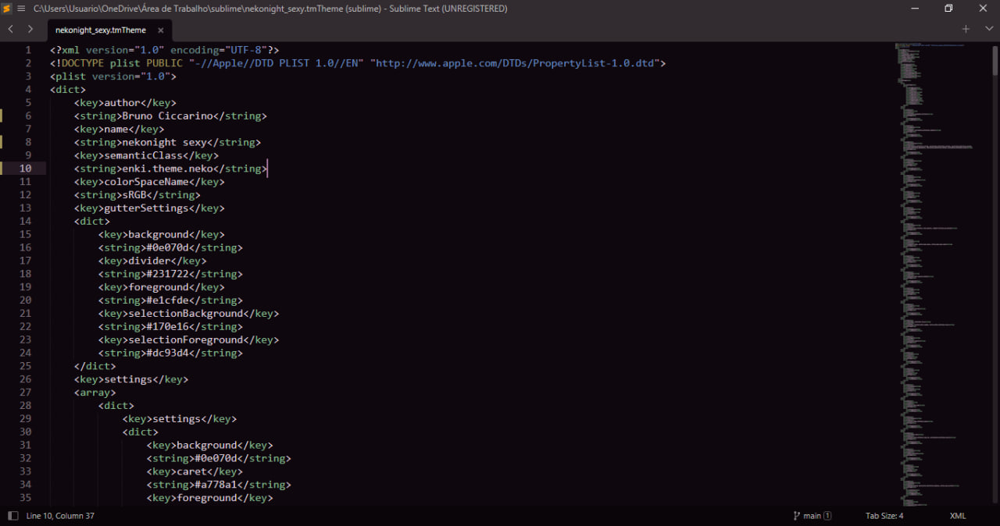

# sublime

Your favorite theme now for sublime text

<table width="100%">
  <tr>
    <th>Moon</th>
    <th>Storm</th>
  </tr>
  <tr>
    <td width="50%">
      
    </td>
    <td width="50%">
      
    </td>
  </tr>
  <tr>
    <th>Night</th>
    <th>Day</th>
  </tr>
  <tr>
    <td width="50%">
      
    </td>
    <td width="50%">
      
    </td>
  </tr>
    <tr>
    <th>Sexy</th>
  </tr>
  <tr>
    <td width="50%">
      
    </td>
  </tr>
</table>

There are a few ways to install this color schemes, one of them is by cloning the repository locally and adding it to the directory where the packages are recognized, in Windows it is a directory like this

`C:\Users\<your user>\AppData\Roaming\Sublime Text\Packages\User`

In the future you will also be able to install the package using package control: install packages. When it is available, you must install it by pressing <command shift + p> on Mac or <ctrl + shift + p> on Windows and search for install packages and press enter on the correct option which will open a prompt for you to search for the package to be installed and there you can search for neko night and the package will appear for you.